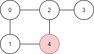

# Практикум 10

## Задачи за графи

### Задача 1 
Има голям панаир в града, в този панаир има много атракции и искаме да пробваме всичките, обаче знаем че като отидем ще се разсеяме и забравим през кои сме минали и кои не сме.
Тъй като искаме да минем през всички точно веднъж, си правим програма която ни казва в какъв ред да ги обходим.

#### Вход
На първият ред стои число **n**, брой атракции, които искаме да посетим. На вторият ред стои число **m**, брой пътища между две атракции. На следващите **m** реда има наредени двойки числа **v1, v2**, казващи че има път между атракция **v1** и атракция **v2**

#### Изход 
Примерен ред в който да обходим атракциите точно веднъж.

### Задача 2 - Разнасяне на вестници
Намираме се в малко село, в него има *n* къщи и *m* пътища, всеки път свързва две къщи. В къща с номер *i* живее едно момче разнасящо вестници. Тъй като е малко, му дават да разнася вестници до точно една къща всеки ден. Момчето иска да раздаде вестници на целият град, затова в следващите *n - 1* дни раздава вестници до различни къщи. 


Да се напише алгоритъм който дава примерен маршрут за всички **n - 1** дни до различна къща, преминавайки през някои от *m*-те пътища без да повтаря къщи по своя маршрут и да не доставя до къща до която е доставил в предишен ден. Да се изведе къщата до която е доставил, денят в който е доставил и пътят по който е поел.

#### Вход
На първите два реда се въвеждат числата **n** - брой къщи и **m** - брой пътища. В следващите **m** реда следват двойки **v1, v2**, казващи че има път от къща **v1** до къща **v2**. След всички тези редове, се въвежда **i** номера на къщата, в която живее момчето и започва разнасянето.

##### Граф


##### Примерен Вход
```
5
5
1 4
0 2
2 3
0 1
2 4
4
```
##### Примерен Изход

```
Delivered to house 2 at day 1
Path: [4]
Delivered to house 3 at day 2
Path: [4 2]
Delivered to house 0 at day 3
Path: [4 2]
Delivered to house 1 at day 4
Path: [4]
```
### Задача 3 - Разнасяне на вестници - Част 2
Детето е доволно от резултата на алгоритъма ни, обаче много се разкарва. Да се пренапише предната задача, така че детето всеки ден да взима най-краткият път до всяка къща, ако предположим, че всеки път е с равна дължина.

### Задача 4 - Разнасяне на вестници - Част 3
Тъй като е придобило опит през последните няколко месеца, родителите му позовяват да раздава вестници до **k** на брой къщи всеки ден. Да се модифицира алгоритъма, така че да не прекратява неговата разходка при първата нова къща, а да намира най-много **k** на брой къщи всеки ден.

### Задача 5 -  Избиране на отговорници
Имаме клас от **n** ученици, трябва да изберем минимален брой отговорници на класа, така че тези отговорници да могат да информират диреткно или косвено целият клас за важни новини и събития.

Предоставя ни се информацията за това, кой ученик с кои други ученици общува. Един ученик можем да го броим за информиран, ако от източника на информация има някакъв редица от ученици, които си общуват взаимно и тази редица завършва на този ученик. 
##### Вход
Брой ученици **n**, последван от число **m** брой общувания и на следващите **m** реда - наредени двойки от ученици, които си общуват.
##### Изход
Минималният брой отговорници на класът